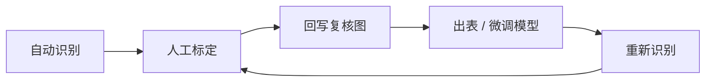

# 导管腔识别与标定 — 使用说明

本系统采用「机理规则 + 深度学习」混合识别：程序先自动预标，专家复核修订后，按复核结果回写对照图、导出 Excel，并可增量更新规则与 YOLO 模型，再对新图重新识别。

**唯一规则文件：** `output/learned_rules.json`（配对参数 + exclusion 排除段；不按文件名存坐标）

**新增约束：**

1. **共壁小腔**：已配对双导管的共壁带内若存在小暗腔（纹孔/空隙，含不如大腔那么黑的紧凑小孔），则不成双导管，两侧只计单导管。  
2. **面积下限**：导管腔 Ai 不得低于教学小腔面积的 80%（当前 `min_lumen_ai_um2` ≈ 102 µm²）；成对成员另需 Ai ≥ `min_pair_ai_um2`（约 200 µm²）。  
3. **禁止套圈**：不得出现绿轮廓套绿轮廓（小腔落在大腔内则去掉小腔）。  
4. **小腔团**：一圈内包住多个碎小暗腔（非单一导管腔）的假腔剔除，且不可参与双导管配对。  
5. **够黑才算导管**：腔内须为深黑空腔（核心灰度偏低、暗像素占比高、相对周围壁有足够反差）；浅灰/带纹理凹陷不算导管。  
6. **双导管间距**：自动配对 `min_gap_um` ≈ 1.5 µm；人工框内绿圈/壁厚线以人工标定几何为准，不做固定远近缩放。

---

## 总体流程

1. 程序自动识别  
2. 人工标定（对照图左侧修订）  
3. 按人工结果回写复核图（可选）  
4. 从复核图出 Excel / 增量训练  
5. 重新识别下一批  



**当前批次产物：**

| 目录 / 文件 | 说明 |
|-------------|------|
| `output/复核_1-40/` | 样品 1–40 对照图（342 张，已人工对齐） |
| `output/复核_41-63/` | 样品 41–63 对照图（184 张，混合识别） |
| `output/人工标定/单导管/` | 单导管人工修订样例（红圈） |
| `output/人工标定/双导管+壁厚+框/` | 双导管人工修订（蓝框+红圈+壁厚短线） |
| `output/dataset_lumen/` | 由复核图导出的 YOLO-seg 训练集 |
| `output/models/lumen_yolov8seg/weights/best.pt` | 当前腔检出权重 |
| `output/excel_samples/样品1-40_扫描电镜指标_自动分析结果.xlsx` | 由复核_1-40 解析出的指标表 |

---

## 1. 程序自动识别

对指定样品范围的 SEM 原图批量处理，生成左右对照图：

- **左**：原图（供对照修改）
- **右**：自动标注（绿轮廓=导管腔；橙框=双导管区；紫十字=Ai；蓝线=TVW）

```bash
cd vessel_pipeline
python run_review_batch.py 41 63 --out-dir 复核_41-63 --wipe --hybrid
```

| 参数 | 含义 |
|------|------|
| `41 63` | 样品号闭区间 |
| `--out-dir` | 输出目录名（写在 `output/` 下） |
| `--wipe` | 先清空再写 |
| `--hybrid` | YOLO 腔检出 + 规则排除/配对/测量（需已有权重） |
| 不加 `--hybrid` | 仅规则识别 |

等价：`python continue_annotate_loop.py preview --lo 41 --hi 63`

---

## 2. 人工标定

专家检查漏检/误检、是否应成双导管、TVW 是否合理。

### 2.1 推荐改法（对照图左侧）

在 `output/复核_*/` 的 PNG **左侧原图**上修订，或将修订图放入：

| 文件夹 | 画法 |
|--------|------|
| `output/人工标定/单导管/` | 红线圈选单导管腔 |
| `output/人工标定/双导管+壁厚+框/` | 蓝/青框圈双导管区；红线圈腔；短蓝线标壁厚（TVW） |

### 2.2 按人工结果回写复核图（样式与复核一致）

**单导管**（仅绿轮廓，无橙框/紫箭/TVW）：

```bash
python _patch_singles_from_human.py
```

按 `人工标定/单导管` 左侧红圈，在 `复核_1-40` 同名图右侧重画绿色线圈。

**双导管**（橙框 + 绿腔 + 紫 Ai + 蓝 TVW）：

```bash
python _patch_dual_from_human.py
```

按 `人工标定/双导管+壁厚+框`：绿腔跟红圈几何，TVW 跟人工短线，橙框跟人蓝框。

也可走通用入库：

```bash
python ingest_review_marks.py --from-review
# 或
python continue_annotate_loop.py ingest --from-review 复核_1-40
```

---

## 3. 从复核图出 Excel

**推荐**（解析复核右侧绿腔/橙框/蓝线，与对照图一致）：

```bash
python run_excel_from_review.py --review 复核_1-40 --lo 1 --hi 40
# 下一批评完后：
python run_excel_from_review.py --review 复核_41-63 --lo 41 --hi 63
```

默认输出：`output/excel_samples/样品{lo}-{hi}_扫描电镜指标_自动分析结果.xlsx`

其他入口（按原图重跑管线出表，不读复核标注）：

```bash
python run_excel_samples.py 1 40
python run_final_526.py
```

---

## 4. 增量训练

### 4.1 更新几何通用规则

```bash
python learn_general_rules.py
```

写入 `output/learned_rules.json`（换图仍有效）。

### 4.2 用复核标注微调 YOLO 腔检出（推荐）

从复核对照图右侧绿轮廓/橙框导出 YOLO-seg 数据集并训练：

```bash
python export_from_review_pngs.py --review 复核_1-40 --wipe
python train_lumen_seg.py --epochs 20 --batch 4 --model output/models/lumen_yolov8seg/weights/best.pt
```

- 数据集：`output/dataset_lumen/`（`data.yaml` + images/labels）  
- 权重：`output/models/lumen_yolov8seg/weights/best.pt`  
- CPU 可训；有 GPU 时加 `--device 0`  

从原图管线导出掩膜（旧路径，仍可用）：

```bash
python export_review_masks.py --lo 1 --hi 40
python train_lumen_seg.py --epochs 20
```

或：

```bash
python continue_annotate_loop.py learn
python continue_annotate_loop.py finetune --epochs 20
```

---

## 5. 重新识别下一批

微调后对新范围再跑混合识别，例如样品 41–63：

```bash
python run_review_batch.py 41 63 --out-dir 复核_41-63 --wipe --hybrid
```

再人工复核 → 回写（如有）→ 出表。

---

## 推荐闭环（1–40 → 41–63 示例）

```bash
# 1) 自动预标
python run_review_batch.py 1 40 --out-dir 复核_1-40 --wipe --hybrid

# 2) 人工在「人工标定/单导管」「双导管+壁厚+框」修订后回写
python _patch_singles_from_human.py
python _patch_dual_from_human.py

# 3) 出表
python run_excel_from_review.py --review 复核_1-40 --lo 1 --hi 40

# 4) 用复核图重训
python export_from_review_pngs.py --review 复核_1-40 --wipe
python train_lumen_seg.py --epochs 20 --model output/models/lumen_yolov8seg/weights/best.pt

# 5) 标定下一批
python run_review_batch.py 41 63 --out-dir 复核_41-63 --wipe --hybrid
python run_excel_from_review.py --review 复核_41-63 --lo 41 --hi 63
```

查看闭环帮助：`python continue_annotate_loop.py help-loop`

---

## 客户常用入口

| 步骤 | 入口 | 作用 |
|------|------|------|
| 1 自动识别 | `run_review_batch.py … --hybrid` | 生成复核对照图 |
| 2 人工回写 | `_patch_singles_from_human.py` / `_patch_dual_from_human.py` | 按人工红圈/框/线对齐复核右侧 |
| 2′ 通用入库 | `ingest_review_marks.py` / `continue_annotate_loop.py ingest` | 收集修订 |
| 3 出表 | `run_excel_from_review.py` | 从复核标注解析 Excel |
| 3′ 更新规则 | `learn_general_rules.py` | 归纳配对阈值 |
| 4 微调模型 | `export_from_review_pngs.py` + `train_lumen_seg.py` | 用复核图训 YOLO-seg |
| 5 再识别 | `run_review_batch.py --wipe --hybrid` | 下一批对照图 |

其余 `.py` 为内部模块，日常无需单独运行。

---

## 识别与规则要点

**流水线：**

```
SEM → [YOLO 腔实例] ∪ [多阈值经典分割补漏]
    → exclusion E0–E4 → 邻腔补检 → 椭圆平滑
    → gap/共壁配对 → TVW/CWR → PNG / Excel
```

**可泛化规则卡片：**

| 对象 | 保留 | 剔除/限制 |
|------|------|-----------|
| 真导管腔 | 暗、近椭圆；Ai ≥ ~102 µm²（教学小腔×80%），上限 ~1500 | 过小、贴边截断、不完整腔 |
| 假腔 | — | 细长裂隙、锯齿渗漏假腔 |
| 单导管 | 未配对且 Ai ≥ min_lumen | 过小不画 |
| 双导管 | gap 约 1.5–23 µm；Ai 比 ≤ 6；TVW 优先跟人工短线（否则 3–5 条）；**共壁带无小腔** | 每图最多 3 区；有小腔则拆成单导管 |
| 尺度 | 左下角绿标尺 20 µm；fallback 0.2233 µm/px | — |

**指标：** Di = 2√(Ai/π)；CWR_side = (TVW/Di)²；样品 CWR = 各侧均值。

**标注颜色（复核右侧）：**

| 颜色 | 含义 |
|------|------|
| 绿轮廓 | 计入统计的导管腔 |
| 橙框 | 双导管区域 |
| 紫十字 | Ai（腔径示意） |
| 蓝线 | TVW（壁厚） |

**约定：**

- 排除只按几何通用规则，换图有效  
- 不读逐图坐标黑名单；`排除_裂隙状腔.csv` 若写出仅为审计，不参与判定  
- 完整相邻双导管必须计入；一侧漏检可旁侧补检  
- 人工双导管回写时：绿圈跟红圈、线跟人工短线，避免程序擅自拉近/拉远  

环境依赖见 `requirements.txt`。
